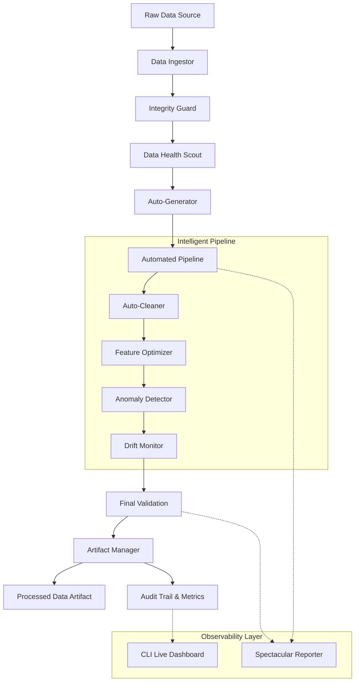

# ML Experimental Standardization Suite (EXSS)

[](#system-architecture)
[](LICENSE)
[](https://www.python.org/)

> **Autonomous Data Intelligence for High-Performance Machine Learning.**

The **Experimental Standardization Suite (EXSS)** is a production-ready orchestration layer designed to eliminate manual data preparation toil. It transforms raw, chaotic datasets into deterministic, model-ready features using advanced statistical heuristics and autonomous cleaning agents.

---

## Core Value Proposition

-   **Deterministic Lineage**: Every dataset is cryptographically signed (SHA-256) and saved as a versioned artifact for 100% reproducibility.
-   **Autonomous Optimization**: Intelligent agents analyze data distributions to dynamically inject cleaning and engineering steps.
-   **Statistical Monitoring**: Integrated drift detection (KS-test) flags distribution shifts before they impact production models.
-   **High-Fidelity Observability**: Real-time terminal dashboards provide institutional-grade telemetry on data health and pipeline performance.

## Quick Start

### 1. Installation
```powershell
pip install -r requirements.txt
```

### 2. Execute Autonomous Pipeline
```python
from src import MLDataEngine, EngineConfig

# Configure the institutional engine
config = EngineConfig(
    output_dir="./experiment_artifacts",
    drift_threshold=0.01,
    enable_persistence=True
)

engine = MLDataEngine(config=config)

# Run orchestration with drift detection
df = engine.run_pipeline(
    input_path="current_data.csv",
    reference_path="reference_data.csv", # Enable drift monitoring
    target_column="conversion"
)
```

## System Architecture

EXSS is built on a modular, decoupled architecture that separates **Intelligence**, **Execution**, and **Reporting**.

### High-Level Design



### Core Components

#### 1. The Intelligence Layer
- **Auto-Generator**: Analyzes data distributions and infers optimal schemas.
- **Data Health Scout**: Performs deep statistical analysis to detect target leakage and quality degradation.
- **Anomaly Detector**: Uses statistical heuristics to flag outliers.
- **Drift Monitor**: Uses Kolmogorov-Smirnov tests to detect distribution shifts against reference data.

#### 2. The Execution Engine
- **MLDataEngine**: The central orchestrator that manages the flow of data.
- **EngineConfig**: Pydantic-based configuration management for institutional-grade control.
- **Artifact Manager**: Versioned persistence layer for data (Parquet) and metadata (JSON).

#### 3. The Integrity Guard
- **SHA-256 Signatures**: Every dataset version is hashed to ensure complete lineage.
- **Schema Enforcement**: Strict Pydantic-based validation of dataset contracts.

#### 4. Observability & Reporting
- **Rich-Native UI**: High-fidelity terminal dashboards provide real-time feedback.
- **Audit Trails**: JSON-formatted logs for integration with experiment tracking systems.

## Data Flow Pattern

1.  **Ingestion**: Load data from CSV/Parquet and generate an initial integrity hash.
2.  **Analysis**: Perform a comprehensive health check. If quality is below the "Golden Threshold", the pipeline halts.
3.  **Dynamic Transformation**: The system applies cleaning and engineering steps based on the inferred schema and detected issues.
4.  **Verification**: A final hash and schema check are performed to ensure the transformation was deterministic and safe.
5.  **Artifact Generation**: The processed dataset and its corresponding metadata (audit trail) are saved as versioned artifacts.

## Visual Intelligence

The suite features a **Spectacular Reporter** powered by `Rich`, providing:
-   **Live Progress Tracking**: Real-time status of multi-stage transformations.
-   **Health Dashboards**: Visual breakdown of completeness, uniqueness, and information density.
-   **Audit Trails**: Comprehensive JSON summaries of every transformation applied.

---

"Standardizing the chaos of experimental data."
